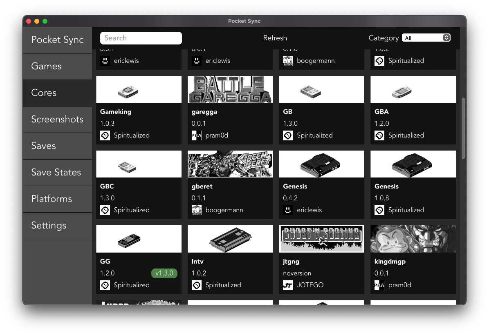

# pocket-sync

A Windows / Mac / Linux GUI to do _stuff_ with the Analogue Pocket.

Features:

- Browse & install cores
- Export corrected & upscalled screenshots
- Backup save files
- Quick links to open game file folders

## Installation

- Download the installer for your platform from [The Latest Release](https://github.com/neil-morrison44/pocket-sync/releases/latest)
- Note you'll need to click through to allow the application on Windows & allow the application from within the Security pane in Settings on MacOS since I can't be bothered setting up (& paying yearly for) the signing process
- The SD card will need to have been initialised by the Pocket to get recognised
- Plug in your Pocket / put in the SD card, click "Connect to Pocket", select the root folder (the one with Assets & Cores & Saves etc in it) and go
- It'll slap a `pocket_sync.json` file on to your pocket to hold config on first run

## Philosophy

- What this purposely _isn't_ is a way to install 100 Cores in 20 seconds without really knowing what any of them are
- I'll not be adding any sort of "Install All" button to the UI, instead it's a slower process of choosing what cores you're interested in & seeing them, including links to support whoever put the time into getting the core onto the Pocket, in more detail.

## Roadmap

### Soon

- Installing / Checking for firmware updates
- Hopefully get the saves backups working how I'd planned
- Support for adding custom images from PNGs etc

### Longer term

- Library viewing / editing once that's rolled out
- Save State management (search, bulk delete etc)
- Add back MiSTer save file sync (don't really want to touch it if there's a chance I'll clopper MiSTer files with a bunch of incompatiable Genesis saves)

## FAQs

### Donations?

Nah, I'm alright - you should donate to the folks porting / building cores over though.

## Thanks to

- [The OpenFPGA Cores Inventory supplies a bunch of the data used in the app](https://github.com/joshcampbell191/openfpga-cores-inventory)
- [This recreation of the Analogue OS font](https://github.com/AbFarid/analogue-os-font)
